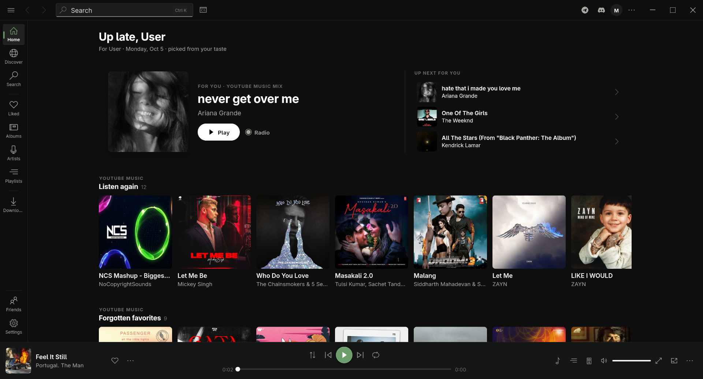
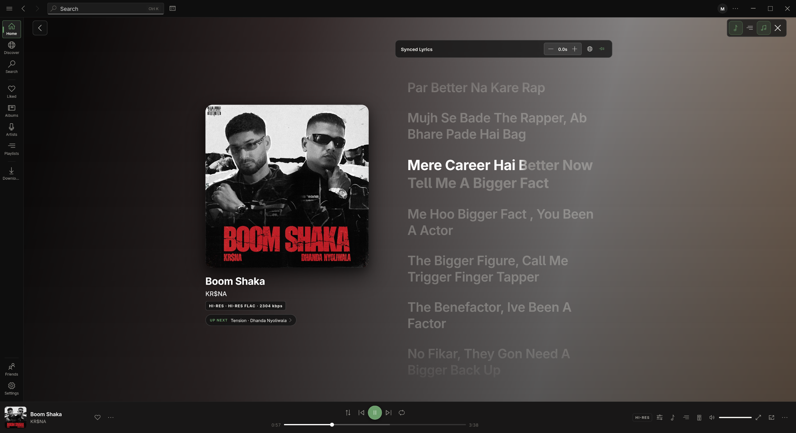

# LastWave

**Next-Gen Lossless Music player with Algorithmic Smart Playlist Generator, Real-Time Synced Lyrics & Last.fm Scrobbler for Desktop.**

  
  
  
  

 

  <h2>Overview</h2>
  
LastWave is a next-gen lossless music player for desktop that comes with an algorithmic smart playlist generator, real-time synced lyrics, and Last.fm scrobbler. It is designed to provide a seamless music listening experience with high-quality audio playback and intelligent playlist management.

  <h2>Features</h2>
  <ul>
    <li>Lossless music playback for high-quality audio experience.</li>
    <li>Algorithmic smart playlist generator that creates playlists based on your listening habits.</li>
    <li>Real-time synced lyrics display for an immersive music experience.</li>
    <li>Last.fm scrobbler integration to track your listening history and discover new music.</li>
    <li>YouTube Music integration for streaming and managing your favorite tracks.</li>
  </ul>

<!-- Getting Started
Download the latest APK from the Releases or Actions tab.
Install LastWave-v4.2.2-release.apk on your Android device (Android 7.0+).
Connect your Last.fm account in Settings → Integrations to unlock the scrobbler, taste mixes, and personalized discovery radar.
Enjoy ad-free streaming and smart playlist generation! -->

  <h2>Installation</h2>
  
To install LastWave on your desktop, follow these steps:

  <ol>
    <li>Download the latest version of LastWave from the <a href="https://github.com/Clash-Projects/LastWave-Desktop/releases">Releases</a> tab.</li>
    <li>Run the installer and follow the on-screen instructions.</li>
  </ol>

##  Disclaimer

> [!NOTE]
> **Educational & Research Notice**
>
> LastWave is an open-source, non-commercial application developed strictly for research and educational purposes.
>
> **No Affiliation & Content Policy**
> - LastWave is an independent project and is **not affiliated with, endorsed, or sponsored by Google LLC, YouTube, YouTube Music, Spotify, Apple Inc., Last.fm, or any music service**.
> - LastWave **does not host, stream from private servers, or distribute any copyrighted media**. All content and metadata are accessed directly from public endpoints in accordance with their respective terms. All trademarks belong to their respective owners.

  
Built with ❤️ by <a href="https://github.com/mrinmoyhaloi">Mrinmoy</a> & <a href="https://github.com/ajisth69">Ajisth</a>.

